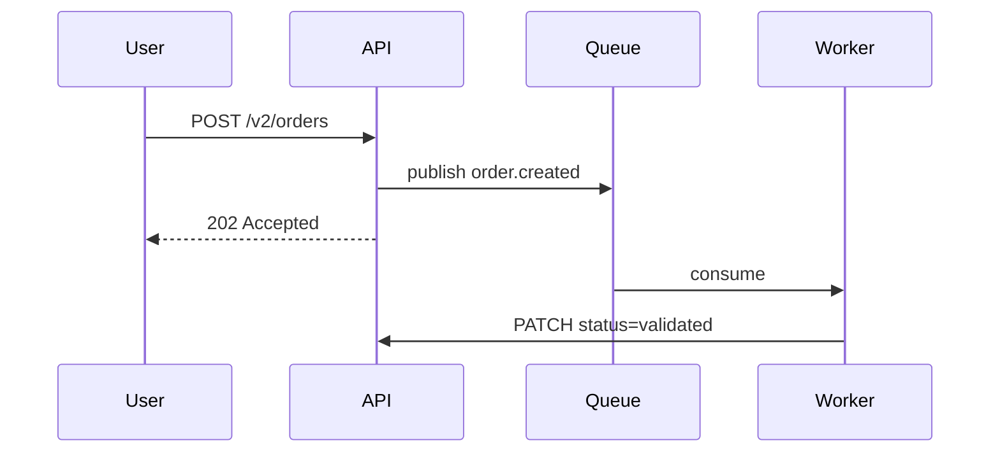

# Technical Specification: Orders Service v2

**Status:** approved
**Author:** @jdoe
**Last updated:** 2026-09-30

## 1. Objective

Rebuild the order processing pipeline to support async validation and bulk imports, removing the synchronous checkout bottleneck that capped us at ~120 orders/min during last quarter's flash sale.

## 2. Background

- Current state: `orders-v1` processes validation synchronously inside the request path; p95 checkout latency spikes to 1.8s under load
- Problem: flash sales saturate the validation thread pool; 3% of orders time out at peak
- Users: shoppers (create orders), ops team (bulk imports), finance (reports)
- Links: PRD-2026-041, incident INC-2026-007 postmortem

## 3. Goals & Non-Goals

**Goals:**
- Async order validation via queue, with order accepted immediately
- Bulk CSV import for ops team (up to 10k rows)
- Keep v1 read compatibility for 90 days

**Non-Goals:**
- Inventory management changes
- Payment provider migration
- Admin UI redesign

## 4. Requirements

### Functional Requirements

| ID | Requirement | Priority |
|----|-------------|----------|
| FR-1 | Users can create, read, update, delete orders | P0 |
| FR-2 | System sends email confirmation on order placement | P1 |
| FR-3 | System supports bulk order import via CSV | P2 |
| FR-4 | RBAC enforced (admin, manager, user) | P0 |

### Non-Functional Requirements

| ID | Requirement | Target |
|----|-------------|--------|
| NFR-1 | p95 order creation latency | < 200ms |
| NFR-2 | Business-hours availability | 99.9% |
| NFR-3 | Peak throughput | 1,000 req/s |
| NFR-4 | Data durability | 99.999999% |
| NFR-5 | Audit log retention | 7 years |

## 5. Design

### Architecture

- C4 container diagram: link to system-diagram
- Dependency map: orders-v2 → kafka → validation-worker → postgres
- ADR-0123: chose Kafka over RabbitMQ for replay capability

### Data Model

```sql
CREATE TABLE orders (
  id UUID PRIMARY KEY,
  user_id BIGINT NOT NULL REFERENCES users(id),
  status VARCHAR(20) DEFAULT 'pending',
  total_cents INTEGER NOT NULL,
  created_at TIMESTAMP DEFAULT NOW()
);
```

### API Contract

- OpenAPI spec: `api/contracts/orders-v2.yaml`
- `POST /v2/orders` → 202 Accepted + `Location: /v2/orders/{id}`

### Sequence Diagram



## 6. Implementation Plan

| Phase | Task | Owner | ETA |
|-------|------|-------|-----|
| 1 | orders table + v2 schema | @backend | Week 1 |
| 2 | async validation worker | @backend | Week 2 |
| 3 | bulk import endpoint | @backend | Week 3 |
| 4 | load testing + cutover | @qa | Week 4 |

## 7. Testing Strategy

- Unit: 80% coverage on validation rules; mock the queue
- Integration: dockerized kafka + postgres in CI
- E2E: create → validate → confirm flow; import 1k-row CSV
- Load: k6, 1,000 req/s sustained 15 min, p95 < 200ms

## 8. Rollout Plan

- Feature flag: `orders_v2_api`, default off
- Staging soak: 1 week, error rate < 0.5%
- Canary: 5% (24h) → 25% (48h) → 100%
- Rollback: flag off if error rate > 1% or p95 > 500ms

## 9. Risks & Mitigations

| Risk | Impact | Likelihood | Mitigation | Owner |
|------|--------|------------|------------|-------|
| Kafka lag under flash-sale load | High | Medium | Consumer autoscaling, lag alerts at >10k msgs | @backend |
| Bulk import corrupts order numbering | Medium | Low | Import uses dedicated ID range + validation job | @backend |
| v1 clients break on new status enum | High | Medium | v1 shim maps new statuses for 90 days | @mobile |

## 10. Success Metrics

- **Adoption**: 95% of order traffic on v2 within 30 days
- **Performance**: p95 order creation < 200ms at 1,000 req/s
- **Reliability**: timeout rate < 0.1% during flash sale
- **Business**: zero checkout-abandonment spike vs. last sale
