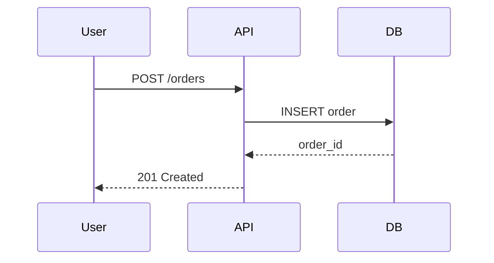

# Technical Specification: `<Capability / System Name>`

**Status:** draft | in-review | approved | implemented
**Author:** @handle
**Last updated:** YYYY-MM-DD

## 1. Objective

One paragraph describing what this spec aims to achieve and why it matters.

## 2. Background

- Current state of the system
- What problem are we solving?
- Who are the users and stakeholders?
- Links to product requirements, user stories, or market research

## 3. Goals & Non-Goals

**Goals** (must achieve):
- [Goal 1]
- [Goal 2]

**Non-Goals** (explicitly out of scope):
- [Non-goal 1]
- [Non-goal 2]

## 4. Requirements

### Functional Requirements

| ID | Requirement | Priority |
|----|-------------|----------|
| FR-1 | The system must... | P0 |
| FR-2 | The system should... | P1 |

### Non-Functional Requirements

| ID | Requirement | Target |
|----|-------------|--------|
| NFR-1 | Latency p95 | < 200ms |
| NFR-2 | Availability | 99.9% |
| NFR-3 | Throughput | 1,000 req/s |

## 5. Design

### Architecture

- Link to C4 diagrams (Context, Container, Component)
- Link to service dependency map
- Link to ADR for major decisions

### Data Model

```sql
CREATE TABLE users (
  id UUID PRIMARY KEY,
  email VARCHAR(255) UNIQUE NOT NULL,
  created_at TIMESTAMP DEFAULT NOW()
);
```

### API Contract

- Link to OpenAPI spec or microservice contract
- Key endpoints, request/response examples

### Sequence Diagram



## 6. Implementation Plan

| Phase | Task | Owner | ETA |
|-------|------|-------|-----|
| 1 | Schema migration | @backend | Week 1 |
| 2 | API implementation | @backend | Week 2 |
| 3 | Frontend integration | @frontend | Week 3 |
| 4 | Load testing | @qa | Week 4 |

## 7. Testing Strategy

- Unit tests: coverage target, mocking approach
- Integration tests: environments, data setup
- E2E tests: critical user flows
- Performance tests: load profile, acceptable thresholds

## 8. Rollout Plan

- Feature flags: which flag, default state
- Staging soak period: duration, success criteria
- Canary percentage: 5% → 25% → 100%
- Rollback criteria: error rate > X%, latency > Yms

## 9. Risks & Mitigations

| Risk | Impact | Likelihood | Mitigation |
|------|--------|------------|------------|
| Data migration takes longer than expected | High | Medium | Run migration in batches, test on copy of prod |
| Third-party API downtime | Medium | Low | Cache responses, implement circuit breaker |

## 10. Success Metrics

- **Adoption**: X% of users use the capability within 30 days
- **Performance**: p95 latency < target
- **Reliability**: error rate < 0.1%
- **Business**: Revenue impact, cost savings
